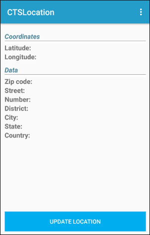
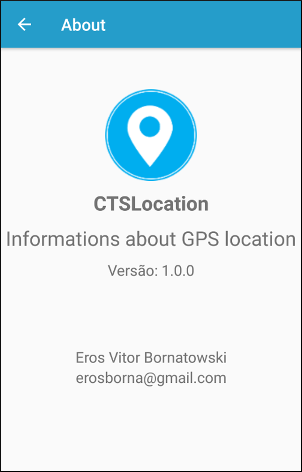

# CTSLocation

## Description

The **CTSLocation** is an Android application that show coordinates and data about your location.

## Screenshots

 

## Release History

* 1.0.0 (2021-04-28)
    * First release
